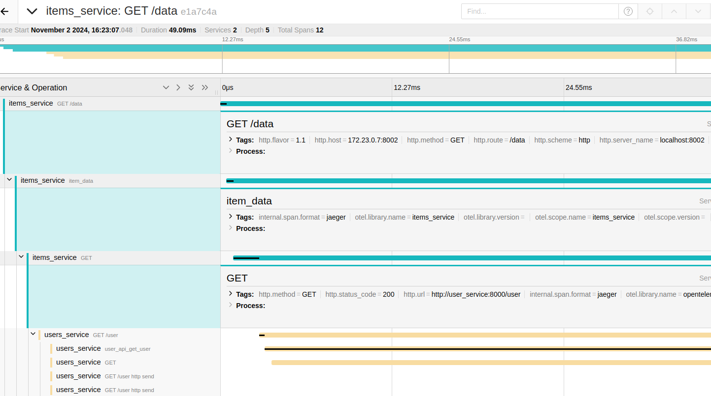

# Basic Instrumentation and Auto Instrumentation of Request Module and FastApi Library

In this scenario we instrument the Users and Items service by:
1. Implementing auto instrumenation for python's `request` and `fastapi` modules. You will be able to realise that you do not need to modify your current application much to benefit from basic tracing capabilities. See the [OpenTelemetry Registry](https://opentelemetry.io/ecosystem/registry/?language=python) for Python packages that can add automatic instrumentation for your favorite Python modules

2. Implementing basic instrumentation providers for the http request handlers.
    The following was done:

    1. Added the `tracer.py` submodule which provides an Otel tracer and an Otel meter for tracing and metrics purposes respectively.
    1. In the `/users` route in `users_service.py`, the tracer adds a parent span to the `get_user` function and also records an event
    1. In the `/data` route in `items_service.py`, the tracer adds a parent span and also records an exception if one occurs
    1. For both services FastAPI is instrumented using the FastAPIInstrumentor
    1. For metrics a simple middle ware is added to each service that counts the number of service calls to each service and records them using a meter. The metrics are exposed on port `9000` of each service, which is configured using the **METRICS_PORT** environment variable(See Docker Compose settings of the services).
    1. Traces are sent directly from the services to Jaeger on the configured **TRACES_ENDPOINT**(See Docker Compose settings of the services)

## Noteworthy remarks about RequestsInstrumentor
Auto instrumentation of API calls when using the `requests` module can automatically propagate contexts to the called API. One can get a unified view of both the caller and the callee in tracing backend (Jaeger). The below image demonstrates how the RequestInstrumentor automatically transfers the span context of the parent API call to the child API

## Dependencies Used:
See [./requirements.txt](./requirements.txt)