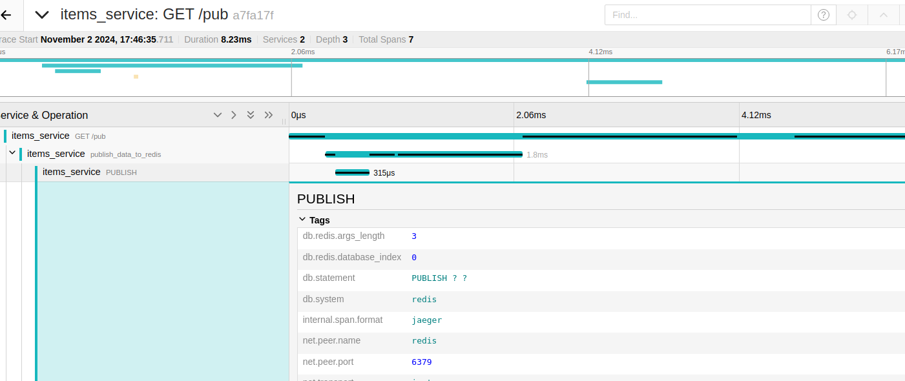

# Scenario 2 Context Propagation of Trace Contexts

What if we want to emphasize the relationship between 2 actions (services) in the system under observation? Tools like the RequestInstrumentor may provide some out-of-the-box trace context propagation for http calls. 

If we want to manually make note of the relationship between 2 traces running in 2 different runtimes, we could add markers about a parent trace when we are sending message between a parent action (or service) and a child action.

In this scenario, we inject the context of the parent trace into the payload being delivered in the publishing of a message to redis and upon reading the message we extract the context from the message.

## Injecting the Parent Context into the PubSub Message Payload

Injecting the context to be propagated looks like shown below. The parent traceid will be automatically propagated to the redis subscriber along with the payload:

```python
# culled from src/items_service

import opentelemetry

@app.get("/pub")
async def publish_redis_message(request: Request):
    print("publishing to redis")
    with tracer.start_as_current_span("publish_data_to_redis"):
        payload = {
            "message": "this is my message",
            "request_id": request.state.request_id
        }
        opentelemetry.propagate.inject(
            payload
        )
        redis_client.publish("my-channel", json.dumps(payload))
```

At the receiving side, extract the propagated context from the payload and record any subsequent actions in the resulting child trace

```python
# from src/redis_subscriber_service.py
from opentelemetry.propagate import extract
from tracer import init_tracer

def message_handler(message):
    message_data = message['data'].decode(DECODE_UTF8)
    channel = message['channel'].decode(DECODE_UTF8)
    
    payload = json.loads(message_data)

    propagated_context = extract(carrier=payload)

    with tracer.start_as_current_span("redis_message_consume", context=propagated_context, attributes=payload):
        print(f"Received {message} from {channel}")
```

And you can see the payload(request_id and message) represented in the traces as shown in Jaeger:


## Auto instrumentation of Redis
We also add auto instrumentation of Redis calls by first installing the `opentelemetry-instrumentation-redis` and initiating it using

```python
RedisInstrumentor().instrument()
```

The result of the autoinstrumentation of Redis can be seen here.
