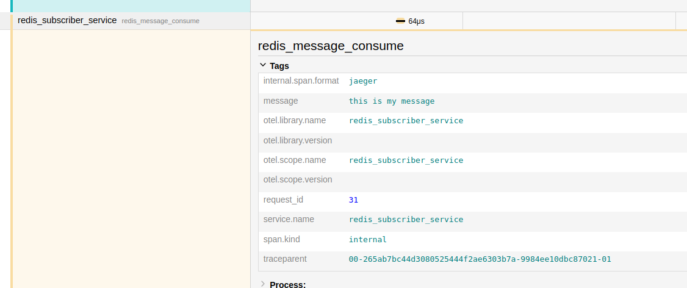

# Auto instrumentation of Redis
We add auto instrumentation of Redis calls by first installing the `opentelemetry-instrumentation-redis` and initiating it using

```python
RedisInstrumentor().instrument()
```

See line 53 in `src/items_service.py`

# Context Propagation from a WebService(Redis Producer) to a Redis Pubsub Consumer
We then add context propagation to allow tracing of redis entries as they are published and consumed

Injecting the context to be propagated looks like shown below. The parent traceid will be automatically propagated to the redis subscriber along with the payload:

```python
# from src/items_service

@app.get("/pub")
async def publish_redis_message(request: Request):
    print("publishing to redis")
    with tracer.start_as_current_span("publish_data_to_redis"):
        payload = {
            "message": "this is my message",
            "request_id": request.state.request_id
        }
        inject(
            payload
        )
        redis_client.publish("my-channel", json.dumps(payload))
```

At the receiving side, extract the propagated context from the payload and record it in the resulting child trace.

```python
# from src/redis_subscriber_service.py
from opentelemetry.propagate import extract
from tracer import init_tracer

def message_handler(message):
    message_data = message['data'].decode(DECODE_UTF8)
    channel = message['channel'].decode(DECODE_UTF8)
    
    payload = json.loads(message_data)

    propagated_context = extract(carrier=payload)

    with tracer.start_as_current_span("redis_message_consume", context=propagated_context, attributes=payload):
        print(f"Received {message} from {channel}")
```

And you can see the payload(request_id and message) represented in the traces as shown in Jaeger:


