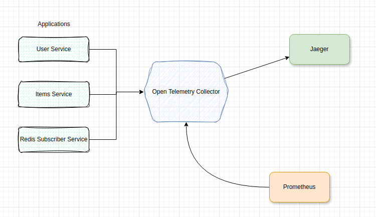

# Scenario3.1: Intro to the Opentelemetry Collector

In this scenario, we remove the direct connection of the microservices to the signals backends (Prometheus and Jaeger), replacing them with a connection to the OpenTelemetry Collector Gateway which will be configured to provide traces to Jaeger and 'scrapable' metrics to Prometheus.



Among other things the Otel Collector serves as an abstract data pipelining solution for observability signals. It provides a unifying mechanism for collecting and curating signals, processing them and exporting them to any compatible backend.

The following were implemented

## 1. Adding the OpenTelemetry Collector Service:
The Open Telemtry Collector service is added to Docker Compose.
```yaml
services:
  collector_gateway:
    image: otel/opentelemetry-collector-contrib
    volumes: 
      - ./config/collector-gateway.yml:/etc/otel-collector-config.yaml
    command: ["--config=/etc/otel-collector-config.yaml"]
    ports:
      - "1888:1888"     # pprof extension
      - "8888:8888"     # Prometheus metrics exposed by the collector
      - "8889:8889"     # Prometheus exporter metrics.
      #                   Prometheus will scrape metrics from 8889
      - "13133:13133"   # health_check extension
      - "4318:4318"     # OTLP HTTP receiver
      - "55670:55679"   # zpages extension
```

## 2. Configuring the Collector
The collector is [configured](./config/collector-gateway.yml) with pipelines for tracing and metrics. 

The collector gateway is configured to receive signals at the port `4318` as shown below and the applications will be reconfigured to send their signals to the collector on this port.

```yaml
receivers:
  otlp:
    protocols:
      http:
        endpoint: 0.0.0.0:4318
```

The collector is configured to export its traces to Jaeger and metrics to Prometheus

```yaml
exporters:
  prometheus:
    endpoint: "0.0.0.0:8889"
    send_timestamps: true
    namespace: otel_prom
    const_labels:
      prom_label_1: prom_value_1
  otlp:
    endpoint: "jaeger:4317"
    tls:
      insecure: true
```

[See the entire configuration here](./config/collector-gateway.yml)


## 3. Redirecting Signals to Otel Collector
The tracing and metrics provider: [tracer](./src/tracer.py) is reconfigured to send its signals to the collector.

