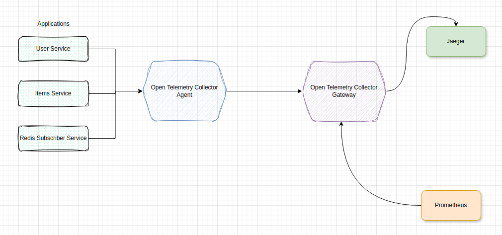

# Scenario3.2: Chaining Collectors

Following from 3.1, in this scenario, we use one Open Telemetry Collector to collect the signals from the services and forward them for processing in a Collector Gateway. Such a system allows for a fine-tuned method of collecting, processing and exporting various signals.




The following were implemented

## 1. Adding the OpenTelemetry Collector Agent Service:
The Open Telemtry Collector service is added to Docker Compose.
```yaml
services:
  collector_agent:
      image: otel/opentelemetry-collector-contrib
      volumes: 
        - ./config/collector-agent.yml:/etc/otel-collector-config.yaml
      command: ["--config=/etc/otel-collector-config.yaml"]
```

## 2. Configuring the Collector
The collector is [configured](./config/collector-agent.yml) with pipelines for tracing and metrics. 

The collector agent is configured to receive signals at the port `4318` as shown below and the applications will be reconfigured to send their signals to the collector on this port.

```yaml
receivers:
  otlp:
    protocols:
      http:
        endpoint: 0.0.0.0:4318
```

The collector agent is configured to export its signals to the collector gateway 

```yaml
exporters:
  otlp:
    endpoint: "collector_gateway:4320"
    tls:
      insecure: true
```

[See the entire configuration here](./config/collector-agent.yml)


## 3. Configuring the Collector Gateway
Using the partial configuration from 3.1, the collector gateway is configured to receive incoming grpc requests on port `4320`. The remaining settings remain the same.

```yaml
# Collector Gateway's Receivers
receivers:
  otlp:
    protocols:
      http:
        endpoint: 0.0.0.0:4318
      grpc:
        endpoint: 0.0.0.0:4320
```


## 4. Redirecting Signals to Otel Collector
The configurations of the signals endpoints of the applications are now routed to the collector agent.

