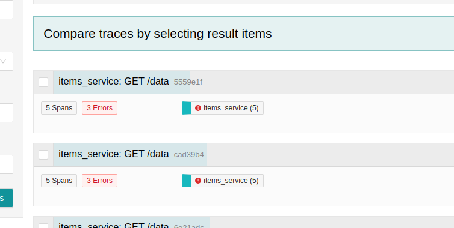

# Scenario 4.1 Implementing Tailbased Sampling in the Collector

In this scenario we add a sampling rule to sample based on exception events that happen in API calls.

The following tail sampling configuration is set in the [collector gateway config](./config/collector-gateway.yml) which only collect traces on error and lateness

```yaml
processors:
  tail_sampling:
    decision_wait: 2s
    num_traces: 100
    expected_new_traces_per_sec: 1
    policies:
      [
        {
          name: errors-policy,
          type: status_code,
          status_code: { status_codes: [ERROR] },
        },
      ]
```

The `tail_sampling` processor is then added to the the pipelines

```yaml
service:
  pipelines:
    traces:
      receivers: [otlp]
      processors: [tail_sampling, batch, resource]
      exporters: [otlp]
```

With this setting, only the errors are recorded in Jaeger



