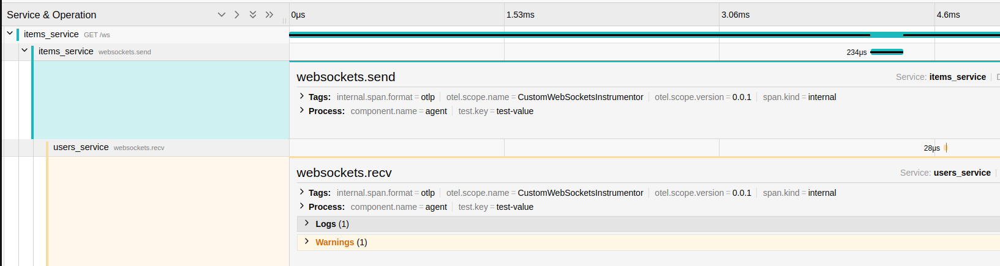

# Scenario5: Custom Instrumentors > An example with Python's WebSockets Module

Inserting tracing and metering logic into one's code can make the codebase unweildy. It will be good in some cases to separate observabibility code from the rest of your application. This can serve 2 purposes:

1. Advanced organizations can have dedicated teams that develop shared Instrumentors for libraries used within the org.
2. For common usecases, there can be a baseline Instrumentor for a particular library
3. Custom observability code is limited and only developed when more sophisticated application insights are needed.

In this scenario we instrument the `send` and `recv` functions of Python's `websockets` module.

We use the decorators `observe_send` and `observe_recv` to patch the send and recv member variables of the `websockets.WebSocketCommonProtocol.send` and `websockets.WebSocketCommonProtocol.recv` functions.

The implementation of the instrumentor is as follows:

```python
class WebSocketsInstrumentor(BaseInstrumentor):
    def __init__(self):
        self._original_send = websockets.WebSocketCommonProtocol.send
        self._original_recv = websockets.WebSocketCommonProtocol.recv


    def _instrument(self, **kwargs):
        websockets.WebSocketCommonProtocol.send = observe_send(websockets.WebSocketCommonProtocol.send)
        websockets.WebSocketCommonProtocol.recv = observe_recv(websockets.WebSocketCommonProtocol.recv)


    def _uninstrument(self, **kwargs):
        # Restore original methods
        websockets.WebSocketCommonProtocol.send = self._original_send
        websockets.WebSocketCommonProtocol.recv = self._original_recv

    def instrumentation_dependencies(self) -> Collection[str]:
        return ['websockets ~= 13.1']
```
And the traces related to websocket messaging can be seen here:




